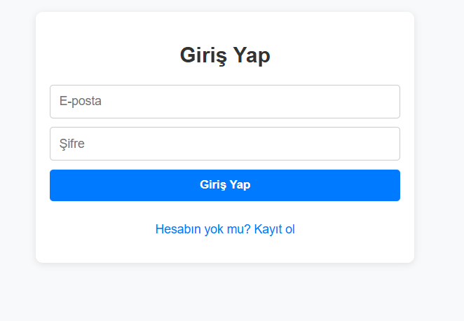
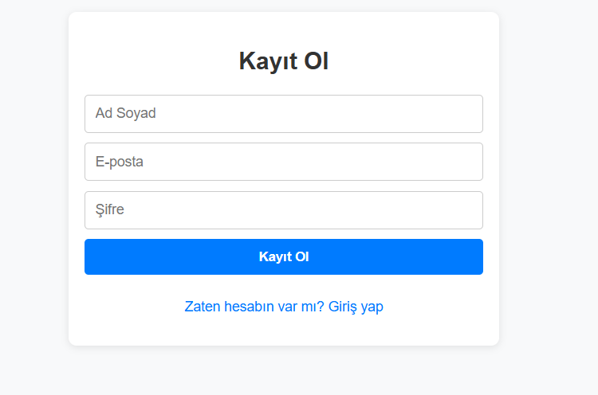
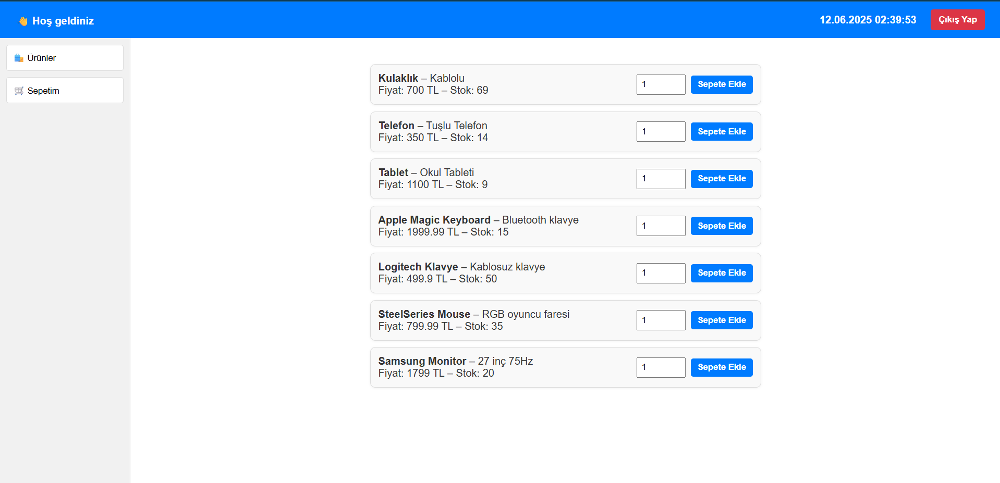
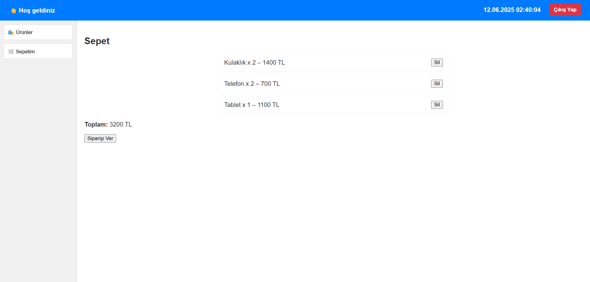
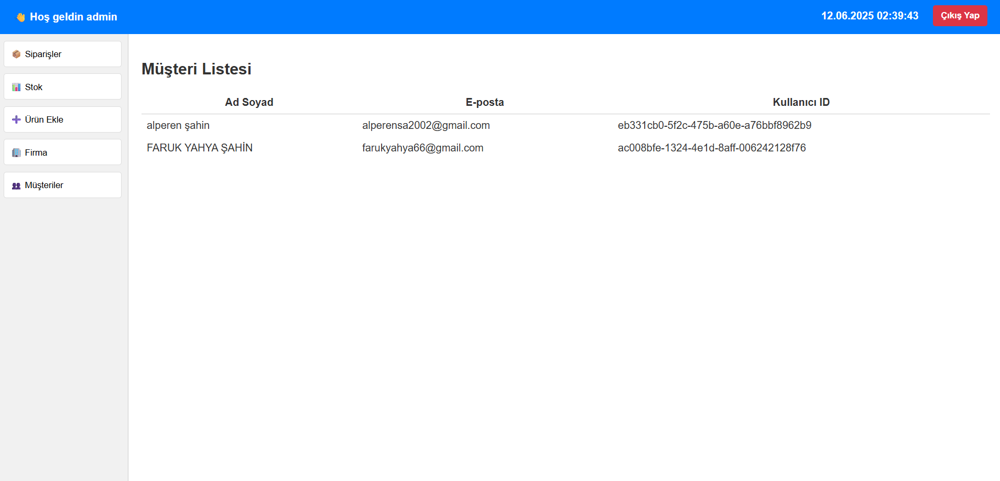
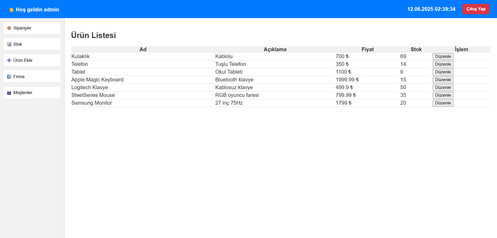
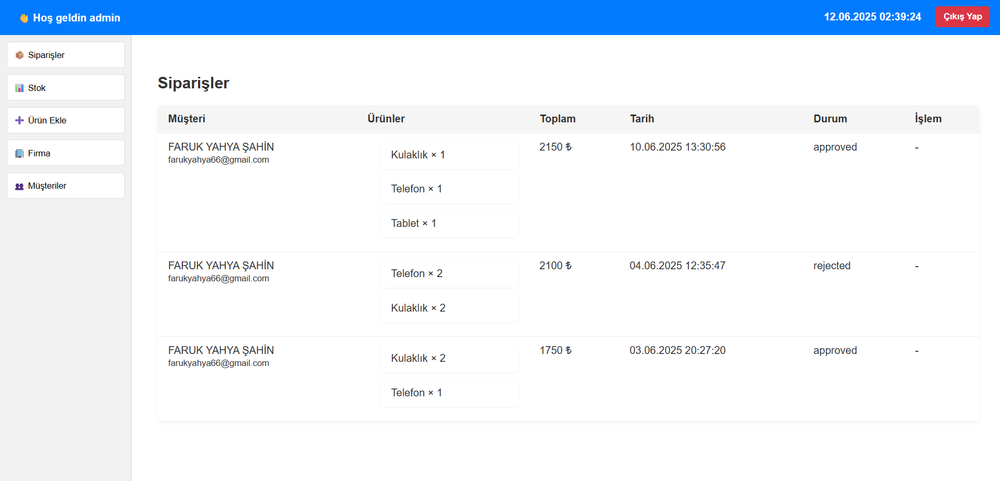

# 🧾 ERP Yönetim Paneli (React + Node.js + Supabase)

Bu proje, bir ERP sisteminin temel işlevlerini içeren tam yığın (full-stack) bir uygulamadır. Admin ve kullanıcı rolleriyle giriş yapılabilen bu sistemde, ürün yönetimi, stok takibi, müşteri yönetimi ve sipariş işlemleri yer almaktadır.

## 🔧 Teknolojiler
- **Frontend:** React.js
- **Backend:** Node.js + Express
- **Veritabanı:** Supabase (PostgreSQL)
- **Kimlik Doğrulama:** Supabase Auth

---

## 🖼️ Ekran Görüntüleri

### 🔐 Giriş Sayfası


### 🆕 Kayıt Sayfası


### 👤 Kullanıcı Paneli (Ürün Listesi)


### 🛒 Kullanıcı Sepeti


### 🧑‍💼 Admin Paneli


### 📦 Admin Stok Yönetimi


### 📑 Admin Sipariş Yönetimi


---

## 🚀 Kurulum ve Çalıştırma


```bash

### 1. Backend Kurulumu
cd backend
npm install 
node index.js

### 2. Frontend Kurulumu
cd frontend
npm install
npm start